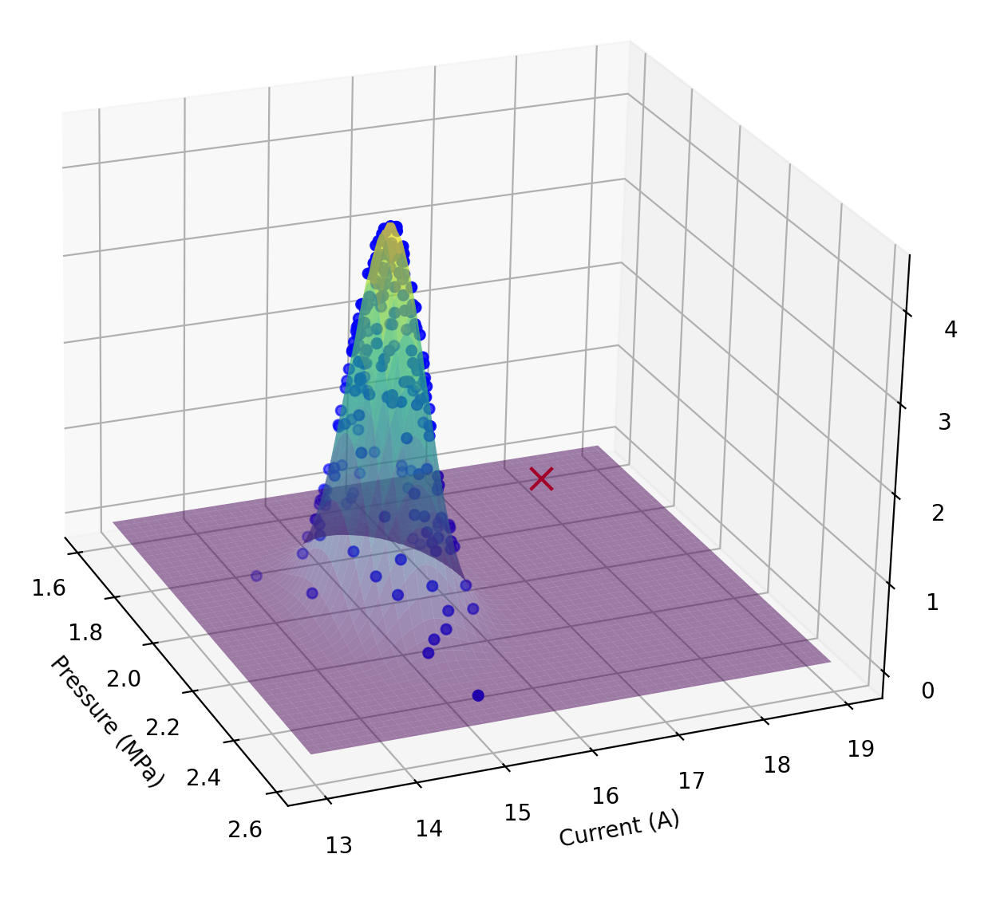
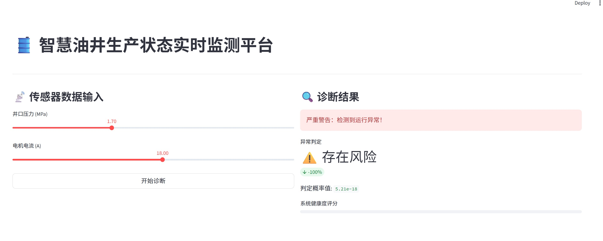

# 🛢️ 能源设备多维运行状态监测系统 (Energy-Anomaly-Detector)

> **基于多元高斯分布 (Multivariate Gaussian) 的工业级异常检测方案**

## 📖 项目背景
针对石油/能源行业中单一阈值报警无法识别“逻辑冲突型”异常（如：压力降低但电流激增）的痛点，本项目开发了一套基于统计学习的实时监测系统。该系统能捕捉传感器数据的多维相关性，实现毫秒级风险预警。

## 🌟 核心亮点 (Key Features)
- **跨维度逻辑检测**：利用 **协方差矩阵 (Covariance Matrix)** 建模特征耦合关系，精准识别违反物理逻辑的隐蔽故障。
- **自动化参数寻优**：自主实现 **F1-Score** 验证机制，在极度不平衡样本下自动搜索最佳概率阈值 $\epsilon$。
- **全栈工程架构**：
  - **算法层**：Python + SciPy 实现多元高斯建模与模型持久化。
  - **服务层**：基于 **FastAPI** 封装异步推理接口，支持高并发数据流处理。
  - **展示层**：使用 **Streamlit** 构建可视化驾驶舱，提供 3D 概率曲面分析与实时报警。

## 🛠️ 技术栈 (Tech Stack)
- **Core**: Python 3.9+, NumPy, Pandas, SciPy
- **Web**: FastAPI, Uvicorn, Streamlit
- **Visualization**: Matplotlib (3D), Streamlit Charts

## 📂 项目结构
```text
Energy-Anomaly-Detection/
├── data/               # 模拟传感器数据
├── models/             # 训练好的模型权重 (pkl)
├── src/                # 核心代码
│   ├── train.py        # 模型训练与 3D 可视化
│   ├── main.py         # FastAPI 后端推理服务
│   └── app_ui.py       # Streamlit 前端交互界面
└── requirements.txt    # 项目依赖

## 📊 系统演示 (System Demo)

### 1. 3D 概率曲面分析
下图展示了多元高斯模型对正常数据（蓝色点）与异常数据（红色点）的区分能力。正常数据聚集在高概率密度“山峰”区域，而异常点落在低概率平原。


### 2. 实时监测仪表盘
基于 Streamlit 构建的交互式前端，当检测到“压力降低且电流激增”的逻辑冲突时，系统会立即触发红色警报。

