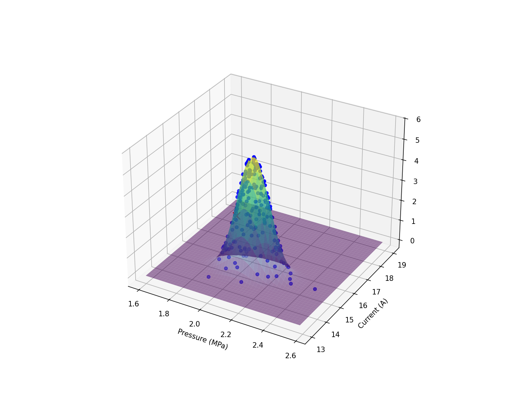
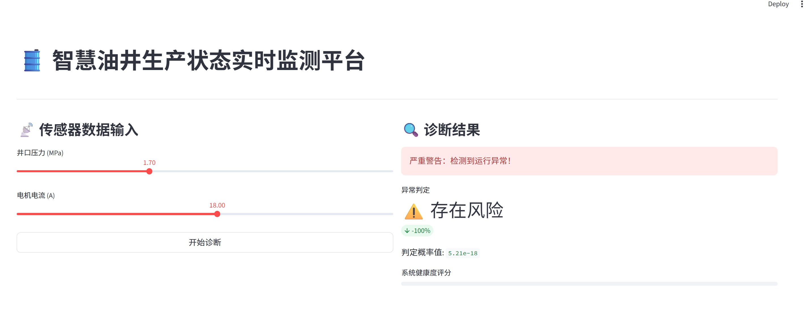

# 🛢️ 能源设备多维运行状态监测系统 (Energy-Anomaly-Detector)

> **基于多元高斯分布 (Multivariate Gaussian) 的工业级异常检测方案**

## 📖 项目背景
针对石油/能源行业中单一阈值报警无法识别“逻辑冲突型”异常（如：压力降低但电流激增）的痛点，本项目开发了一套基于统计学习的实时监测系统。该系统能捕捉传感器数据的多维相关性，实现毫秒级风险预警。

## 🌟 核心亮点 (Key Features)
- **跨维度逻辑检测**：利用 **协方差矩阵 (Covariance Matrix)** 建模特征耦合关系，精准识别违反物理逻辑的隐蔽故障。
- **阈值自动寻优**：训练时在标注样本（200 条正常 + 1 条注入异常）上基于 **F1-Score** 自动搜索最优概率阈值 ε（`src/threshold.py` 的 `find_best_threshold`），并把 ε 作为模型元数据写入 `models/energy_model.pkl`；推理服务优先读取元数据中的 ε，旧模型文件自动回退默认 1e-5。
- **全栈工程架构**：
  - **算法层**：Python + SciPy 实现多元高斯建模与模型持久化。
  - **服务层**：基于 **FastAPI** 封装异步推理接口，支持高并发数据流处理。
  - **展示层**：使用 **Streamlit** 构建可视化驾驶舱，提供 3D 概率曲面分析与实时报警。
  - **工程护栏**：模型输出路径守卫（`src/model_paths.py`，越出 `models/` 目录的 `ENERGY_MODEL_PATH` 会被拒绝）+ pytest 回归测试。

## 🛠️ 技术栈 (Tech Stack)
- **Core**: Python 3.9+, NumPy, Pandas, SciPy
- **Web**: FastAPI, Uvicorn, Streamlit
- **Visualization**: Matplotlib (3D), Streamlit Charts
- **Testing**: pytest, FastAPI TestClient

## 📂 项目结构
```text
Energy-Anomaly-Detector/
├── src/                        # 核心代码
│   ├── train.py                # 模型训练与 3D 可视化
│   ├── main.py                 # FastAPI 后端推理服务
│   ├── app_ui.py               # Streamlit 前端交互界面
│   ├── model_paths.py          # 模型输出路径守卫
│   └── threshold.py            # F1 阈值搜索工具函数
├── tests/                      # pytest 测试套件
├── scripts/                    # 辅助脚本
│   └── real_time_monitor.py    # 实时监测命令行演示
├── models/                     # 训练好的模型权重 (pkl)
├── assets/                     # 演示截图
├── requirements.txt            # 项目依赖
└── .gitignore
```

## 🚀 快速开始 (Quick Start)

### 1. 安装依赖
```bash
pip install -r requirements.txt
```

### 2. 训练模型
```bash
python src/train.py
```
脚本会把多元高斯参数 μ/σ 与 F1 自动选出的阈值 ε 一起保存到 `models/energy_model.pkl`（另含 `n_samples`、`threshold_method`、`trained_at` 元数据），随后弹出 3D 概率曲面窗口（蓝色为正常点、红色为异常点）；关闭窗口后脚本即结束。可通过环境变量 `ENERGY_MODEL_PATH` 指定 `models/` 目录内的其他输出路径，越出该目录的路径会被拒绝。

### 3. 启动推理服务
```bash
uvicorn src.main:app --port 8000
```

### 4. 调用推理接口
服务启动后，另开一个终端执行：
```bash
curl -X POST http://127.0.0.1:8000/predict -H "Content-Type: application/json" -d "{\"pressure\":1.7,\"current\":18.0}"
```
真实响应示例：
```json
{
  "status": "success",
  "prediction": {
    "is_anomaly": true,
    "probability": 5.212464536070528e-18,
    "threshold": 0.0026430229932921964
  },
  "message": "检测到异常运行"
}
```

### 5. 可视化驾驶舱
保持推理服务运行，另开一个终端执行：
```bash
streamlit run src/app_ui.py
```

### 6. 运行测试
```bash
python -m pytest -q
```

## 📊 系统演示 (System Demo)

### 1. 3D 概率曲面分析
下图展示了多元高斯模型对正常数据（蓝色点）与异常数据（红色点）的区分能力。正常数据聚集在高概率密度“山峰”区域，而异常点落在低概率平原。

### 2. 实时监测仪表盘
基于 Streamlit 构建的交互式前端，当检测到“压力降低且电流激增”的逻辑冲突时，系统会立即触发红色警报。

